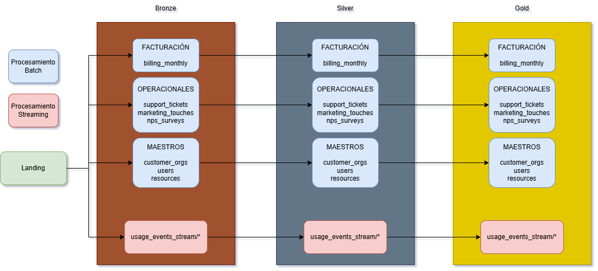
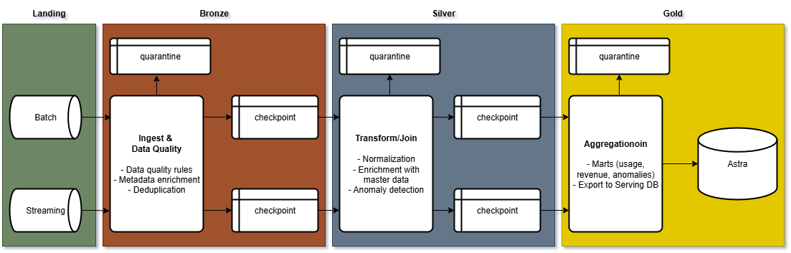

<!-- _class: lead -->

# Cloud Provider Analytics
## ETL + Streaming + Serving en AstraDB

**72.80 - Big Data**

**Fecha:** 09/02/2026

**Presentador** Francisco Marcos Ferrutti

---

## 1. Contexto de Negocio

**Rol:** Equipo de datos de un Cloud Provider.

* **Necesidades del Negocio:**
  * Analítica de **FinOps** (optimización de costos y consumo).
  * Métricas de **Soporte** (cumplimiento de SLAs, volumen de tickets).
  * Métricas de **Producto / GenAI** (uso de tokens, tendencias).

* **Requerimientos Clave:**
  * Procesamiento **Near real-time** para operaciones críticas.
  * Procesamiento **Batch** (diario/mensual) para facturación y reportes consolidados.

---

## 2. Objetivos del Proyecto

Construir un **pipeline end-to-end** robusto y escalable:

* **Ingesta Híbrida:** Soporte para cargas batch (CSV) y streaming (JSONL).
* **Calidad de Datos:** Limpieza, validación y manejo de evolución de esquemas.
* **Marts Analíticos:** Generación de tablas agregadas listas para BI (Gold Layer).
* **Serving Layer:** Disponibilidad de datos con **baja latencia** en AstraDB.

---

## 3. Dataset y Fuentes de Datos

* **Fuentes Batch (CSV):**
  * Maestros: `customers_orgs`, `users`, `resources`.
  * Transaccional: `billing_monthly`, `support_tickets`.
  * Engagement: `marketing_touches`, `nps_surveys`.

* **Fuente Streaming (JSONL):**
  * `usage_events_stream`: Eventos de consumo de recursos.

* **Desafíos:**
  * Evolución de esquema (v1 → v2 con `carbon_kg`, `genai_tokens`).
  * Datos ruidosos, nulos y outliers (costos negativos).

---

## 4. Arquitectura General (Lambda)

Implementación de una **Arquitectura Lambda** para equilibrar latencia y completitud.

---

## 5. Arquitectura del Data Lake

Organización en zonas para garantizar trazabilidad y gobernanza:

* **Landing (Raw Inmutable):** 
  * Datos en formato original, sin modificaciones.
* **Bronze (Raw Estándar):** 
  * Parquet, tipificación básica, deduplicación y metadatos (`ingest_ts`).
* **Silver (Conformado):** 
  * Limpieza, joins con maestros, cálculo de features (KPIs) y control de calidad.
* **Gold (Business Marts):** 
  * Agregaciones optimizadas para consumo final (FinOps, Support, Product).

---

## 6. Patrón Arquitectónico: Lambda

¿Por qué **Lambda Architecture**?

1. **Batch Layer:** Procesa la "verdad histórica" con datos completos y corregidos (Facturación, NPS). 
   * *Garantiza consistencia.*
2. **Speed Layer:** Procesa eventos de uso en tiempo real (`usage_events_stream`).
   * *Garantiza baja latencia.*
3. **Serving Layer:** Unifica las vistas para el usuario final en una base de datos de alta velocidad (AstraDB).

---

## 7. Ingesta Batch

Proceso automatizado para fuentes estáticas y periódicas:

* Lectura desde **Landing**.
* Conversión a **Parquet** en **Bronze**.
* Manejo estandarizado de:
  * Cast de tipos de datos.
  * Imputación o marcado de valores nulos.
  * Frecuencia diaria/mensual.

---

## 8. Ingesta Streaming

Procesamiento continuo de eventos de uso con **Spark Structured Streaming**:

* Lectura de directorio de micro-lotes (`usage_events_stream/*.jsonl`).
* **Watermarking:** Manejo de datos tardíos (late data).
* **Deduplicación:** Basada en `event_id` o ventanas temporales.
* Garantía de consistencia y tolerancia a fallos.

---

## 9. Calidad de Datos

Mecanismos de control implementados:

* **Validaciones de Esquema:** Chequeo de tipos y columnas obligatorias.
* **Reglas de Negocio:**
  * `cost_usd_increment` debe ser positivo.
  * Unicidad de IDs.
* **Cuarentena (Quarantine):**
  * Segregación de registros corruptos o anómalos para reprocesamiento manual, evitando contaminar el pipeline principal.

---

## 10. Transformaciones en Silver

El corazón del procesamiento ETL:

* **Normalización:** Estandarización de regiones y nombres de servicios.
* **Enriquecimiento:** Join de eventos de uso con `orgs`, `users` y `projects`.
* **Cálculo de Métricas:**
  * Costos diarios acumulados.
  * Métricas de sostenibilidad (`carbon_kg`).
  * Métricas de GenAI (`genai_tokens`).

---

## 11. Gold Layer — Marts de Negocio

Tablas diseñadas específicamente para responder preguntas de negocio:

1. **FinOps:**
   * `org_daily_usage_by_service`
   * `cost_anomaly_mart`
2. **Soporte:**
   * `tickets_by_org_date` (SLA breaches, volúmenes)
3. **Producto:**
   * `genai_tokens_by_org_date` (Adopción de IA)

---

## 12. Serving Layer — AstraDB (Cassandra)

Base de datos NoSQL para el consumo de baja latencia.

* **Tecnología:** **DataStax AstraDB (SaaS Cassandra)**.
* **Ventajas:** Escalabilidad lineal y alta disponibilidad.
* **Diseño:**
  * Modelado basado en queries (**Query-First Design**).
  * Uso de **Colecciones (JSON Documents)** para flexibilidad de esquema (adaptado con `astrapy`).

---

## 13. Carga de Datos a Cassandra

Implementación técnica de la publicación de datos:

* **Cliente:** Integración vía **`astrapy.collections.DataAPIClient`**.
* **Estrategia:** 
  * Inserción eficiente de documentos JSON desde la capa Gold.
  * Manejo de *Upserts* para evitar duplicados en reprocesos.
  * Abstracción de la complejidad de conexión mediante credenciales seguras.

---

## 14. Performance y Escalabilidad

* **Optimizaciones Spark:**
  * Partition pruning en lecturas Parquet.
  * Uso eficiente de memoria en Workers.
* **Escalabilidad del Serving:**
  * AstraDB maneja el escalado automático de almacenamiento y throughput.
  * Modelo de datos desnormalizado para lecturas constantes O(1).

---

## 15. Consultas de Demostración

Ejemplos de insights obtenidos desde AstraDB:

1. **Top Servicios por Costo:** Identificación de `compute` y `database` como principales drivers.
2. **Anomalías de Consumo:** Detección de picos de costo > P99.
3. **Adopción GenAI:** Crecimiento mensual de `genai_tokens` por organización.
4. **SLA Tracking:** Tasa diaria de tickets con SLA incumplido.

---

## 16. Demo del Pipeline

1. Ejecución del ETL Batch.
2. Ingesta Streaming de eventos.
3. Consulta en tiempo real a AstraDB.

---

## 17. Decisiones y Trade-offs

* **Lambda vs Kappa:** Se eligió Lambda para garantizar la rectificación histórica completa a pesar de la mayor complejidad de mantenimiento.
* **AstraPy vs Spark Connector:** Se optó por el **Data API Client** (`astrapy`) por su flexibilidad con documentos JSON y facilidad de uso en entornos serverless/cloud, frente a la rigidez del conector nativo JDBC/Spark.
* **Parquet:** Balance ideal entre compresión y velocidad de lectura para el Data Lake.

---

## 18. Conclusiones

* **Objetivo Cumplido:** Pipeline operativo end-to-end desde raw data hasta dashboarding potencial.
* **Valor de Negocio:** Visibilidad inmediata de costos y métricas operativas.
* **Siguientes Pasos:**
  * Implementar Dashboards en tiempo real (Grafana/Looker).
  * Automatizar reentrenamiento de modelos de detección de anomalías.

---

<!-- _class: lead -->

# ¿Preguntas?

Gracias por su atención.
